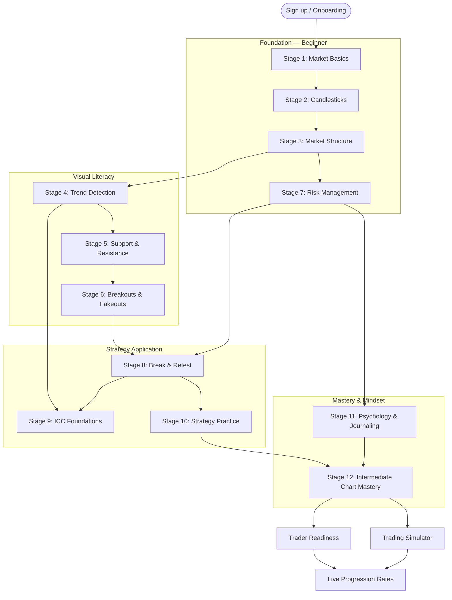
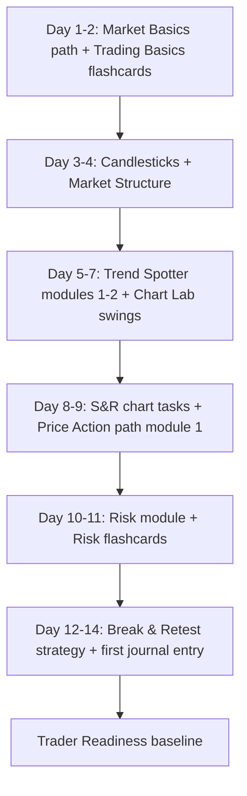

# TradeTrainer Academy — Learning Map Journey

> Complete learner progression with unlock conditions, dependencies, and premium gates.  
> Primary source: `content/learning-map/stages.ts`, `nodes.ts`, `unlock-rules.ts`

## Journey Overview

---

## Node-Level Dependency Graph

```mermaid
flowchart LR
    subgraph s1 [Market Basics]
        A1[What is Trading?]
        A2[What Moves Price?]
        A3[Trading Basics Quiz]
    end

    subgraph s2 [Candlesticks]
        B1[Candlestick Anatomy]
        B2[Bullish vs Bearish]
        B3[Candlestick Quiz]
    end

    subgraph s3 [Structure]
        C1[Swing Highs/Lows]
        C2[Trends vs Ranges]
        C3[Spot Trend Drill]
    end

    A1 --> A2 --> A3 --> B1 --> B2 --> B3 --> C1 --> C2
    C2 --> C3
    C2 --> D1

    subgraph s4 [Trend Spotter]
        D1[What is a Trend?]
        D2[Uptrend vs Downtrend]
        D3[Trend vs Range]
        D4[10-Chart Challenge]
    end

    D1 --> D2 --> D3 --> D4

    C2 --> E1
    D3 --> E1

    subgraph s5 [S&R]
        E1[Identify Support]
        E2[Identify Resistance]
    end

    E1 --> E2 --> F1

    subgraph s6 [Breakouts]
        F1[Mark Breakout]
        F2[Fake Reversals]
    end

    F1 --> F2 --> G1

    C2 --> H1
    subgraph s7 [Risk]
        H1[What is Risk?]
        H2[Risk/Reward]
        H3[Book: R/R Ratio]
    end

    H1 --> H2 --> H3
    F2 --> G1
    H2 --> G1

    subgraph s8 [Break & Retest]
        G1[Break & Retest Strategy]
        G2[Break & Retest Practice]
        G3[Break & Retest Flashcards]
    end

    G1 --> G2 --> G3

    G2 --> I1
    D3 --> I1

    subgraph s9 [ICC]
        I1[ICC: Indication]
        I2[ICC Strategy Wiki]
    end

    I1 --> I2

    E2 --> J1
    subgraph s10 [Strategy Practice]
        J1[Support Bounce]
        J2[Strategy Challenge]
        J3[Advanced Challenge]
    end

    J1 --> J2
    G2 --> J3
    D4 --> J3

    H2 --> K1
    subgraph s11 [Psychology]
        K1[First Journal]
        K2[Beginner Trading Rules]
        K3[Building Consistency]
    end

    K1 --> K3
    H2 --> K2
```

---

## Premium Gates

| Content | Gate |
|---|---|
| All paths except first lesson | Pro subscription, admin grant, or dev unlock |
| `/paths/trading-foundations/lessons/what-is-trading` | **Free** (authenticated) |
| Dashboard, Learning Map, Settings, Profile, Training | Free (authenticated) |
| Library, Flashcards, Chart Lab, Trend Spotter, Strategy Wiki, Simulator, Journal, Progress, Leaderboard, Trader Readiness | Pro |

Private beta mode (`NEXT_PUBLIC_PRIVATE_BETA=true`): checkout disabled; testers receive admin grants.

---

## Feature Unlock Timeline

| After completing… | Unlocks |
|---|---|
| What is Trading? | Trading Library (starter) |
| Candlestick Anatomy | Candlestick flashcards |
| Swing Highs and Swing Lows | Chart Lab swing markup, chart flashcards |
| Trend vs Range | Trend Spotter 10-chart challenge |
| Identify Resistance | Full Chart Lab levels, S&R strategies |
| Mark Breakout | Break & Retest strategy (preview during fakeout stage) |
| Fake Reversals | Break & Retest full access |
| Risk/Reward lesson | Intermediate strategies, risk flashcards |
| Break & Retest practice | Full strategy practice mode, break-retest flashcards |
| ICC Indication | ICC chart lab markup |
| First journal entry | Full journaling |
| Trend challenge + Advanced strategy challenge | Full exploration mode |

---

## Assessment Gates

| Gate | Requirement |
|---|---|
| Stage progression | Required nodes per stage (`requiredNodeIds` in `stages.ts`) |
| Quiz pass threshold | 70% default (`DEFAULT_QUIZ_PASS_THRESHOLD`) |
| Strategy challenge | Prior strategy practice + 70%+ on basic challenge (messaging) |
| Trader Readiness Strategy pillar | Requires strategy completion in user state |
| Live Progression — Simulated phase | 60% overall competence, 40% min pillar |
| Live Progression — Live Prep | 75% overall, 50% min pillar, 50% journal rate |
| Live Progression — Go Live | 80% overall, 60% min pillar, 80% journal rate |

---

## Parallel Learning Tracks

Learners can progress along multiple tracks simultaneously:

1. **Learning Map** (guided nodes) — primary spine
2. **Paths** (structured courses) — Trading Foundations → Price Action → ICC
3. **Trading Library** (97 concepts) — deep reference, not fully gated by map
4. **Trend Spotter** (20 lessons + 16 exercises) — overlaps Stage 4 & 12
5. **Strategy Wiki** (12 playbooks) — unlocks from Stage 8–10
6. **Simulator** (5 stages) — open to Pro users; competence gates for live transition

---

## Recommended Learner Path (First 2 Weeks)

---

## Content Not on Learning Map (Discovery Routes)

These are valuable but require self-navigation:

- `/library` — 97 book concepts (67 + 30)
- `/strategy-wiki` — 12 strategies (partially gated)
- `/simulator` — 5-stage sim (not node-gated)
- `/trader-readiness` — 7-pillar assessment
- `/flashcards` — 12 decks with deck-level gates
- `/quizzes` — quiz index (4 path quizzes)
- `/learn` — flat lesson catalog from paths
