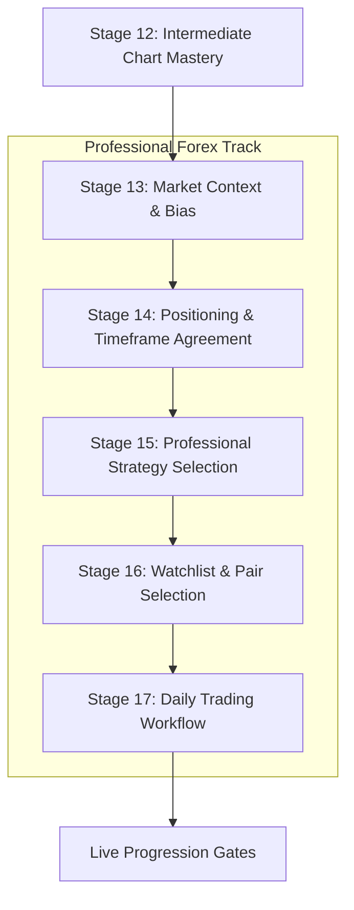

# Professional Forex Track — Curriculum Expansion Audit

> Comparison of existing TradeTrainer curriculum vs new professional trading event material.  
> **This is a curriculum design document. No application code was changed.**  
> Baseline: `01_curriculum_inventory.md` – `08_curriculum_statistics.md` · Codebase verified July 2026.

---

## How this audit was performed

Every expo concept was searched against the actual codebase (`content/`, `lib/`), not against assumptions. For each concept, four questions were answered:

1. **Already exists?** → where, and at what depth
2. **If partial → improve or merge?**
3. **If missing → what to build** (lessons, exercises, flashcards, chart labs, quizzes)
4. **Best placement** in the learning journey

---

## 1. Curriculum Comparison Table

Coverage codes: 🟢 Well covered · 🟡 Partial · 🔴 Absent

| Expo concept | Coverage | Where it exists today | Verdict |
|---|:-:|---|---|
| **Market context / top-down analysis** | 🔴 | One passing mention in Trend Spotter ("higher-timeframe context") — no lessons | **Create** (Stage 13, Module 1) |
| **Direction / daily bias** | 🟡 | Trend Spotter teaches *chart-level* bias ("Building a Trend Bias" lesson); no *daily pre-session* bias workflow | **Extend + new lessons** |
| **DXY / Dollar Index** | 🔴 | Zero matches anywhere in codebase | **Create** (Stage 13, Module 3) |
| **Market sentiment / risk-on–risk-off** | 🔴 | Zero matches. "Sentiment" never appears in content | **Create** (Stage 13, Module 4) |
| **Institutional positioning** | 🔴 | Nothing on COT, retail vs institutional, liquidity pools | **Create** (Stage 14) |
| **Higher Timeframe Agreement / MTF** | 🟡 | ICC flashcards (`htf-bias`, `ltf-confirm` cards); 2 Trend Spotter scenarios (`ts-htf-uptrend-ltf-pullback`, `ts-htf-downtrend-ltf-correction`); ICC stage lists "HTF bias" as skill. **No dedicated lessons** | **Expand into full module** (Stage 14) — reuse existing scenarios |
| **Confidence scoring / multiple confirmations** | 🔴 | Trader Readiness scores *the learner*, not *the trade*. Nothing scores a setup | **Create** (Stage 14 capstone) |
| **Continuation framework** | 🟢 | Trend Spotter Module 4 ("Continuation After Pullback"), ICC path (whole premise), Trend Pullback + flag strategies, 35 mentions in curriculum | **Improve, don't duplicate** — add "filtering continuation days" lesson only |
| **Reversal framework** | 🟢 | Trend Spotter Module 4 ("Early Reversal Warnings", "Fake Reversals"), Reversal strategy playbook, fakeout chart labs | **Improve, don't duplicate** — add exhaustion + swing-reversal depth |
| **EMA framework (20/50/200)** | 🟡 | Moving Average Trend strategy exists (generic "moving average", 9/20 EMA mention in Book Lab flashcard). No structured EMA stack teaching | **Expand** Moving Average Trend strategy + new lessons |
| **Stochastic** | 🔴 | Zero matches | **Create** (indicator lesson + strategy dependency) |
| **Bollinger Breakout Band** | 🔴 | Zero matches for Bollinger | **Create** (new Strategy Wiki playbook) |
| **Momentum Bounce (EMA 20/50/200, D/4H/30m)** | 🟡 | Overlaps VWAP Bounce + Trend Pullback structure; EMA-specific version absent | **Create as new playbook**, cross-link existing |
| **Advanced Reversal Swing (EMA 5/10 + Stoch, Daily)** | 🔴 | No swing-holding or multi-day trade management content | **Create** (playbook + trade-management lessons) |
| **EOD Continuation (EMA 20/50/200, Daily)** | 🔴 | All current strategies are intraday-framed | **Create** (playbook) |
| **EOD Reversal (EMA 5/10 + Stoch, Daily)** | 🔴 | Same | **Create** (playbook) |
| **Watchlist building** | 🟡 | Book Lab `watchlist-building` concept + Stocks in Play section — **stock-scanner focused**, not forex pairs | **Create forex version** (Stage 16); cross-link Book Lab concept |
| **Daily pair selection / ranking** | 🔴 | Nothing ranks or filters currency pairs | **Create** (Stage 16) |
| **Pair scoring (Trend/DXY/Sentiment/Momentum)** | 🔴 | Nothing | **Create** (Stage 16 interactive) |
| **Execution workflow / daily routine** | 🟡 | Book Lab `pre-market prep` concept (stocks); ICC reflection builds a checklist; psychology book teaches pre-trade checklist *as discipline*. No unified daily workflow | **Create** (Stage 17) — merge threads |
| **Economic calendar / high-impact news** | 🟡 | Book Lab `catalysts-and-news` (stock catalysts). No forex calendar, NFP/CPI/FOMC content | **Create** (Stage 13 or 17) |
| **Session analysis (London/NY/Asia)** | 🟡 | 2 forex flashcards (London, New York); "session" used loosely in day-trading strategies. No lessons | **Create** — natural home is the empty **Forex Basics path** |
| **Currency strength & weakness** | 🔴 | Zero | **Create** (Stage 13) |
| **Correlation (DXY↔EURUSD, Gold↔USD)** | 🔴 | Zero | **Create** (Stage 13, with DXY module) |
| **Trade checklist (in-app mandatory)** | 🟡 | Checklist *content blocks* exist in lessons; no app-level pre-trade gate | **Product feature**, not just content (Stage 17 + journal integration) |
| **Post-trade review linked to strategy** | 🟡 | Journal exists; Book Lab journaling section (7 concepts); no strategy-tagged review flow | **Extend journal** + Stage 17 lesson |

### Summary counts

| Verdict | Concepts |
|---|---:|
| 🟢 Already well covered (improve only) | 2 |
| 🟡 Partial — expand/merge | 9 |
| 🔴 Entirely missing — create | 14 |

---

## 2. Gap Analysis — What TradeTrainer Cannot Teach Today

### Conceptual gaps (no content at all)

1. **Inter-market analysis** — DXY, correlation, currency strength. The academy treats every chart as an island. This is the single biggest philosophical gap: a funded trader never opens EURUSD without knowing what the dollar is doing.
2. **Sentiment & macro context** — risk-on/risk-off, positioning, calendar events. Nothing prepares a learner for *why* Tuesday's chart behaves differently from NFP Friday.
3. **Trade selection as a daily process** — current curriculum teaches "is this setup valid?" but never "which of 20 pairs deserves my attention today?"
4. **Indicator literacy** — the entire platform is indicator-free by design (pure price action). EMAs, Stochastic, and Bollinger Bands need to be *introduced as concepts* before any expo strategy can be taught.
5. **Swing / multi-day trading** — everything is intraday-framed. EOD strategies, holding overnight, weekly pip targets (100–300 pips) are absent.
6. **A unified daily workflow** — pieces exist (checklists, journaling, prep) scattered across Book Lab and psychology content, but there is no "this is your morning routine" spine.

### Structural gaps (content exists, wrong shape)

- **HTF agreement** is taught via 2 flashcards and 2 practice scenarios — it deserves a full module since the expo made it central.
- **Watchlist building** exists but for US equities (gappers, float, catalysts) — forex pair selection follows completely different logic (DXY, sessions, correlation).
- **Continuation vs reversal** is taught as *chart reading* but not as *strategy selection* ("today is a continuation day, so I run the continuation playbook").

### Technical prerequisite (flag for implementation phase)

The chart engine (`lib/charts/generate-scenario.ts`) generates candles + structural annotations only — **no indicator overlays**. EMA/Stochastic/Bollinger strategies cannot have interactive Chart Lab practice until the generator supports indicator rendering. Plan content in two tiers:
- **Tier 1 (no engine work):** lessons, flashcards, quizzes, strategy playbooks with described (static) examples
- **Tier 2 (engine work):** interactive indicator-based chart tasks and simulator scenarios

---

## 3. Recommended Learning Map — The Professional Forex Track

Current map ends at **Stage 12 — Intermediate Chart Mastery**. The professional track begins exactly there, as proposed. This preserves the beginner journey and gives it a destination.



### Stage 13 — Market Context & Bias *(new)*

| Module | Lessons | Practice | Notes |
|---|---|---|---|
| 1. Market Context | What is context? · Why every trade starts with context · Top-down analysis · The bigger picture | "Analyse today's market before opening a chart" reflection | All-new |
| 2. Direction | Bullish vs bearish bias · HTF direction · Daily trend alignment · Why counter-direction trading loses | Determine direction on EURUSD, GBPUSD, Gold (3 chart exercises) | Extends Trend Spotter "Building a Trend Bias" — link back, don't re-teach swing structure |
| 3. DXY | What is the Dollar Index? · Why DXY moves forex · Inverse relationships · When to ignore DXY | "Predict EURUSD from DXY" paired-chart exercise | All-new; needs paired-chart UI or static examples |
| 4. Sentiment & Calendar | Risk-on vs risk-off · News vs sentiment · Economic calendar · High-impact events (NFP, CPI, FOMC) | "Classify today's sentiment" quiz | All-new |
| 5. Currency Strength | Strong vs weak currencies · Pairing strong against weak · Correlation basics | Strength-matrix exercise | All-new |

**Unlock:** Stage 12 complete. **New flashcard deck:** Market Context (~12 cards). **Quiz:** Stage 13 milestone (helps close the assessment gap from `03_content_gap_analysis.md`).

### Stage 14 — Positioning & Timeframe Agreement *(new + merged)*

| Module | Lessons | Practice | Notes |
|---|---|---|---|
| 1. Positioning | Retail vs institutional · Where liquidity sits · Building directional confidence | — | All-new; also closes the H1 "liquidity" gap from the earlier audit |
| 2. HTF Agreement | Multi-timeframe analysis · Daily → 4H → 1H → 15m execution ladder | Timeframe-matching interactive; **reuse** `ts-htf-uptrend-ltf-pullback` + `ts-htf-downtrend-ltf-correction` scenarios | Promotes existing flashcards/scenarios into a proper module |
| 3. Confidence Score | Multiple confirmations · The confluence checklist | Build a confidence score: Trend ✓ DXY ✓ Sentiment ✓ Positioning ✓ → trade/skip | Capstone interactive — natural fit for the existing trade-or-skip pattern from Trend Spotter |

### Stage 15 — Professional Strategy Selection *(new playbooks + reframing)*

The key insight from the expo: **teach strategy *selection*, not just strategies.** The Strategy Wiki already has 12 playbooks taught independently — this stage adds the missing "which one today?" layer.

| Item | Type | Overlap handling |
|---|---|---|
| "Which strategy fits today's market?" | New framing lesson | Entry point for the whole stage |
| Continuation filtering | 1–2 lessons | **Do not** re-teach continuation — Trend Spotter Module 4 owns that. Teach *filtering* (is today a continuation day?) |
| Reversal filtering + exhaustion + swing reversals | 1–2 lessons | Extends existing "Early Reversal Warnings" |
| Indicator primer: EMAs (5/10/20/50/200) | 2 lessons | Prerequisite for all playbooks below; expand Moving Average Trend strategy |
| Indicator primer: Stochastic | 1 lesson | All-new |
| Indicator primer: Bollinger Bands | 1 lesson | All-new |
| **Momentum Bounce** (EMA 20/50/200 · D/4H/30m) | New Strategy Wiki playbook | Cross-link Trend Pullback + VWAP Bounce as intraday cousins |
| **Advanced Reversal Swing** (EMA 5/10 + Stoch · Daily · 100–300 pips/wk) | New playbook | Introduces swing holding + multi-day management — first non-intraday strategy |
| **EOD Continuation** (EMA 20/50/200 · Daily) | New playbook | |
| **EOD Reversal** (EMA 5/10 + Stoch · Daily) | New playbook | |
| **Bolly Breakout Band** (Bollinger · 1H/5m) | New playbook | Teach compression → expansion; cross-link existing Breakout lessons |

Strategy Wiki grows 12 → **17 playbooks**, organized into "Price Action" (existing) and "Indicator / Professional" (new) categories. The existing `StrategyCategory` model already supports categories.

### Stage 16 — Watchlist & Pair Selection *(new, forex-specific)*

| Module | Lessons | Practice |
|---|---|---|
| 1. Why professionals don't scan everything | Focus vs FOMO · Removing low-quality pairs | — |
| 2. Building the daily watchlist | Continuation watchlist · Reversal watchlist · Session timing (which pairs move when) | Rank 20 pairs interactive |
| 3. Daily pair scoring | Score = Trend + DXY + Sentiment + Momentum (each /5) | Score EURUSD, GBPJPY, Gold; pick top 3 |

Cross-link (don't duplicate) Book Lab's `watchlist-building` concept — frame it as "the equities version of the same discipline."

### Stage 17 — Daily Trading Workflow *(new capstone)*

The routine from the whiteboard, taught as one linear workflow lesson series, then operationalized:

```
Morning → DXY → Sentiment → Direction → Watchlist → Continuation or Reversal?
→ Strategy selection → Entry → Risk → Journal → Review
```

| Item | Type |
|---|---|
| The professional morning routine | Lesson |
| Session analysis (London / NY / Asia) | 2 lessons — also backfills the empty **Forex Basics** path |
| The pre-trade checklist | Lesson + **product feature** (mandatory in-app checklist before simulator/journal entry) |
| Strategy-tagged post-trade review | Lesson + journal enhancement (tag entries with the strategy used) |
| Full workflow simulation | New simulator stage 6: run one complete day (context → score → select → execute → journal) |

Stage 17 completion feeds directly into the existing **Live Progression gates** (`lib/competence/live-trading-phases.ts`) — the workflow habits (journal completion rate, checklist adherence) are exactly what those gates already measure.

---

## 4. Expansion Roadmap — Ordered by Educational Impact

| # | Work item | Impact | Effort | Why this order |
|---|---|:-:|:-:|---|
| 1 | **Stage 13: Context, Direction, DXY, Sentiment** (lessons + flashcards + quiz) | Very high | Medium | Biggest conceptual gap; zero overlap risk; pure content, no engine work |
| 2 | **HTF Agreement module** (Stage 14) | High | Low | Mostly promotes existing scenarios/flashcards into lessons |
| 3 | **Confidence Score interactive** (Stage 14 capstone) | High | Medium | Reuses trade-or-skip mechanics; makes stages 13–14 practical |
| 4 | **Indicator primer lessons** (EMA, Stochastic, Bollinger) | High | Low–Med | Prerequisite for all 5 new strategies; Tier 1 (no chart-engine work) |
| 5 | **5 new Strategy Wiki playbooks** (Momentum Bounce, ARS, EOD ×2, Bolly) | High | Medium | Data model already supports playbooks; ship without interactive practice first |
| 6 | **Stage 16: Watchlist + pair scoring** | High | Medium | New interactive component (ranking/scoring UI) |
| 7 | **Stage 17: Daily workflow + sessions + checklist** | Very high | Medium | Capstone; also backfills Forex Basics path with session content |
| 8 | **Chart engine: indicator overlays** (EMA/Stoch/Bollinger rendering) | Medium | High | Unblocks Tier 2 interactive practice for new strategies |
| 9 | **Simulator stage 6: full-day workflow** | Medium | High | Depends on 1–7 |
| 10 | **Journal strategy-tagging + mandatory checklist feature** | Medium | Medium | Product work, pairs with Stage 17 |

**Content volume estimate:** ~35–40 new lessons, 5 strategy playbooks, 3–4 flashcard decks (~40 cards), 5 stage quizzes, 2 new interactive exercise types (pair ranking, confidence scoring). Roughly **+8–10 hours** of learner content, lifting the advanced-tier deficit flagged in `08_curriculum_statistics.md` (currently only ~8 advanced units vs ~80 beginner).

---

## 5. Final Recommendation

**Option E — a combination, anchored by a new advanced track (Option B).**

| Component | Where it goes | Rationale |
|---|---|---|
| Context, DXY, Sentiment, Positioning, Watchlist, Workflow | **New "Professional Forex Track"** — Stages 13–17 on the Learning Map | These are workflow/meta skills, not chart patterns. They don't fit any existing path, and inserting them earlier would overwhelm beginners who haven't mastered structure yet |
| 5 expo strategies | **Strategy Wiki additions** (new "Professional" category) | The playbook model (9 steps, examples, practice) fits perfectly; keeps all strategies in one searchable place |
| Continuation/reversal *filtering* | **Extend Trend Spotter Module 4** + Stage 15 lessons | The recognition skills already exist and are good — only the "selection" layer is new |
| Session analysis | **Backfill Forex Basics path** | Kills two birds: fills a critical-severity empty path (C2 in the gap analysis) with genuinely useful content |
| Full-day workflow practice | **New Simulator stage** (later phase) | The simulator is the right place for process rehearsal, but it's the most expensive piece — do it last |
| Pre-trade checklist, strategy-tagged journal | **Product features** | These make the workflow *enforced*, not just taught — the difference between an academy and a blog |

### Why not the alternatives alone

- **A (just add lessons):** scattering DXY/sentiment lessons into existing paths breaks the beginner narrative and buries the professional layer where nobody will find it as a coherent journey.
- **C (just Strategy Wiki):** the expo's core message was *process before setups* — strategies alone miss the point.
- **D (just simulator):** highest cost, and learners need the conceptual layer first.

### The resulting academy narrative

1. **Foundation (Stages 1–7):** learn the language of markets
2. **Application (Stages 8–12):** repeatable setups + risk + psychology
3. **Professional Workflow (Stages 13–17):** think like a funded trader — filter the market, build a watchlist, select the right strategy, execute a routine, review

This directly addresses the two biggest weaknesses from the baseline audit: the missing advanced tier and the abrupt ending after Intermediate Chart Mastery — and it does so without touching a single existing lesson.

### Guardrails for the implementation phase

1. **Never re-teach what exists** — every new lesson that touches trend, structure, or continuation must *link back* to the existing lesson, not restate it.
2. **Every stage gets a milestone quiz** — new content must not repeat the assessment gap (currently 0 milestone tests across 12 stages).
3. **Prerequisites are explicit** — Stage 13 requires Stage 12; indicator strategies require indicator primers; the workflow stage requires everything.
4. **Ship Tier 1 before Tier 2** — lessons/playbooks/flashcards first; indicator chart-engine work is a separate, later project.
5. **Simulated data only** — DXY/sentiment lessons must use illustrative or historical examples, consistent with the platform's "educational simulator, not financial advice" disclaimers.
