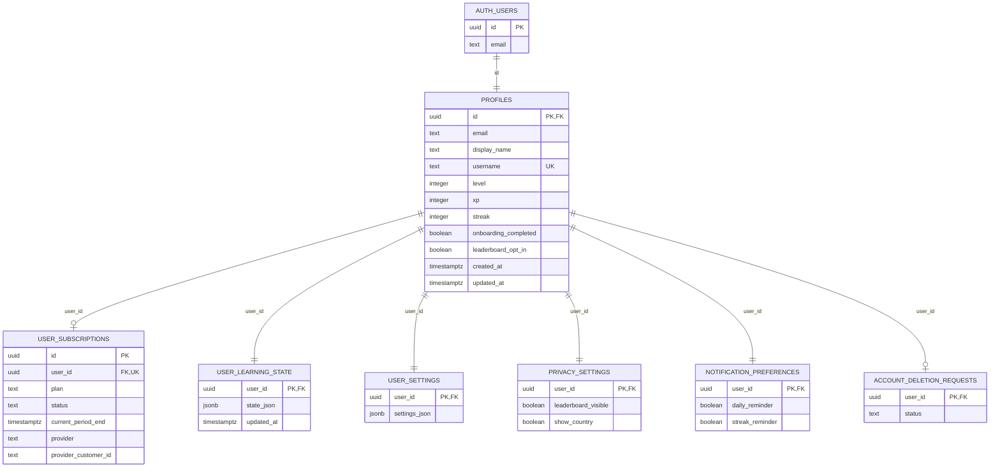
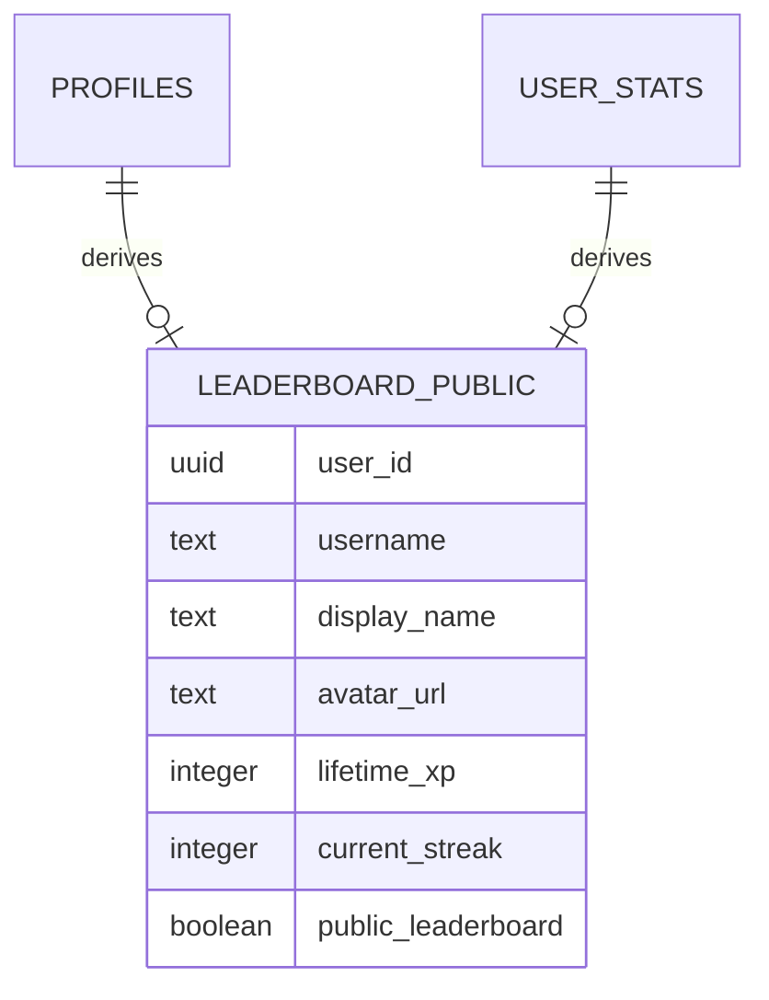
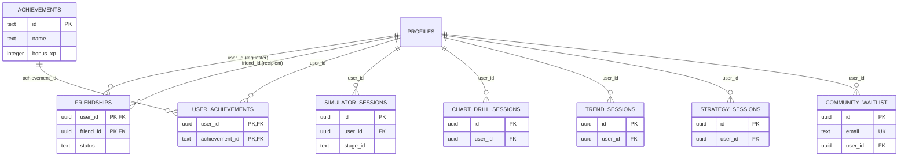

# Database ERD — TradeTrainer Academy

Companion to [`database-audit.md`](./database-audit.md). Supabase project `tradetrainer-ai` (`njsvozqbgirsikscaxbq`), Postgres 17.

This diagram shows the **live schema** — the 27 tables the app actually reads/writes (confirmed by grepping every `.from("...")` call site), centered on `profiles`. It does **not** include the 19 superseded tables from the original Codecademy-style content model (`learning_paths`, `lessons`, `quizzes`, `quiz_attempts`, `drill_sessions`, `ai_reviews`, `journal_entries`, `badges`, and friends) — see the [Unused tables](./database-audit.md#headline-finding-19-of-46-tables-are-dead) section of the audit for that list and why they're dormant.

Every table below has RLS enabled and is scoped to `auth.uid()` unless noted otherwise.

## Core identity & subscription

`PROFILES.id` is both the primary key and a foreign key to `auth.users(id)` (`on delete cascade`). `USER_SUBSCRIPTIONS.plan` is `free|weekly|six_month|annual`; `status` is `inactive|active|cancelled|expired|trialing`. `updated_at` on `PROFILES` and `USER_LEARNING_STATE` (and every table in the next diagram) is maintained automatically by a `set_updated_at()` trigger as of migration `013`.

## Progress, gamification & activity (one row / many rows per user)

```mermaid
erDiagram
    PROFILES ||--|| STREAKS : "user_id"
    PROFILES ||--|| WEEKLY_TARGETS : "user_id"
    PROFILES ||--|| USER_STATS : "user_id"
    PROFILES ||--|| TRADER_COMPETENCE : "user_id"
    PROFILES ||--|| LIVE_TRADING_PHASE : "user_id"
    PROFILES ||--o{ XP_EVENTS : "user_id"
    PROFILES ||--o{ USER_PROGRESS : "user_id"
    PROFILES ||--o{ USER_LESSON_PROGRESS : "user_id"
    PROFILES ||--o{ BEHAVIORAL_EVENTS : "user_id"
    PROFILES ||--o{ PROGRESS_ARCHIVES : "user_id"
    PROFILES ||--o{ PROGRESS_RESET_EVENTS : "user_id"
    PROFILES ||--o{ USER_BADGES : "user_id"
    PROFILES ||--o{ FEATURE_ENROLLMENTS : "user_id"
    PROFILES ||--o{ PATH_ENROLLMENTS : "user_id"

    STREAKS {
        uuid user_id PK, FK
        integer current_streak
        integer longest_streak
    }
    WEEKLY_TARGETS {
        uuid user_id PK, FK
        integer days_per_week
        jsonb active_days_by_week
    }
    USER_STATS {
        uuid user_id PK, FK
        integer lifetime_xp
        integer highest_rank_tier
        integer competency_score
    }
    TRADER_COMPETENCE {
        uuid user_id PK, FK
        integer overall_score
        text weakest_area
    }
    LIVE_TRADING_PHASE {
        uuid user_id PK, FK
        text current_phase
    }
    XP_EVENTS {
        uuid id PK
        uuid user_id FK
        text source
        integer amount
        text date_key
        text week_key
    }
    USER_PROGRESS {
        uuid id PK
        uuid user_id FK, UK
        text entity_type UK
        text entity_id UK
        text status
    }
    USER_LESSON_PROGRESS {
        uuid id PK
        uuid user_id FK, UK
        text lesson_id UK
        text status
    }
    BEHAVIORAL_EVENTS {
        uuid id PK
        uuid user_id FK
        text pillar
        integer score
    }
    PROGRESS_ARCHIVES {
        uuid id PK
        uuid user_id FK
        text section
        jsonb archived_state
    }
    PROGRESS_RESET_EVENTS {
        uuid id PK
        uuid user_id FK
        text section
    }
    USER_BADGES {
        uuid user_id PK, FK
        text badge_id PK
    }
    FEATURE_ENROLLMENTS {
        uuid id PK
        uuid user_id FK, UK
        text feature_id UK
    }
    PATH_ENROLLMENTS {
        uuid id PK
        uuid user_id FK, UK
        text path_id FK, UK
    }
```

Composite unique constraints (both columns marked `UK` on the same table, e.g. `USER_PROGRESS.user_id` + `entity_type` + `entity_id`) enforce "one row per user per item" — Mermaid doesn't have a native multi-column-unique marker, so read repeated `UK` tags on one table as one combined constraint. `BEHAVIORAL_EVENTS` and `PROGRESS_RESET_EVENTS` are append-only by design (insert + select policies only, no update/delete).

## Public leaderboard (view, no RLS — reads from `profiles` + `user_stats`)

`leaderboard_public` is a Postgres `view` (not a table), granted `select` to `anon, authenticated`. It intentionally excludes `email` and any other PII, and only surfaces rows where `public_leaderboard = true` **and** the user has set a non-empty `username`.

## Scaffolded-but-real features (dormant today, not superseded)

These exist for features that are built in the schema but not yet wired into the UI. Fully audited and indexed as of migration `013` so they're correct the day they're used.

`FRIENDSHIPS` has two relationships to `PROFILES` (requester via `user_id`, recipient via `friend_id`) — as of migration `013` both sides can update the row (requester creates/manages it, recipient can accept/decline). `COMMUNITY_WAITLIST.user_id` is nullable with `on delete set null`, so a waitlist signup survives account deletion.

## Legend

- `PK` — primary key, `FK` — foreign key, `UK` — unique constraint (Mermaid markers, comma-separated when an attribute is more than one).
- `||--||` one-to-one · `||--o|` one-to-zero-or-one · `||--o{` one-to-many.
- Every table above supports full owner-scoped CRUD via RLS (`auth.uid() = user_id`, or `= id` for `profiles`) unless noted as append-only.

## Not diagrammed: superseded legacy tables

`learning_paths`, `modules`, `lessons`, `lesson_progress`, `quizzes`, `quiz_questions`, `quiz_attempts`, `drill_sessions`, `ai_reviews`, `journal_entries`, `badges`, `path_progress`, `book_progress`, `flashcard_progress`, `chart_progress`, `trend_progress`, `strategy_progress`, `assessments`, `enrollments` (19 tables) — the original DB-driven content/progress model, replaced by `content/registry` (static TS) + `user_learning_state` (JSONB). Zero application code references any of them. See the audit doc for the drop/keep decision.
